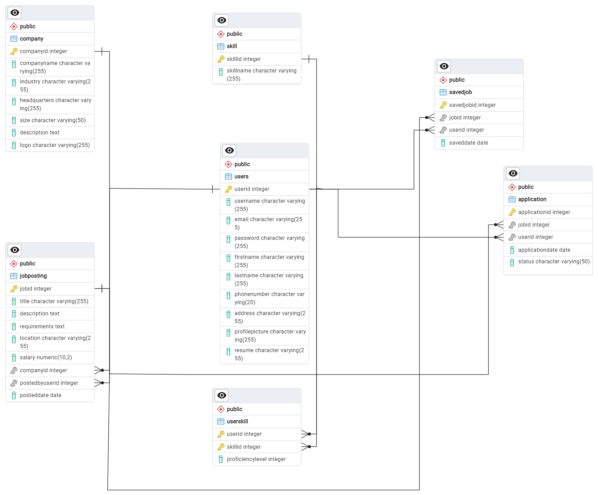

# Capstone project: Relational  Database

## Product Dissection for Naukri.com

### Company Overview

**Founder:** Sanjeev Bikhchandani
**Owned and Operated by:** Info Edge(India) Ltd
**Founded in:** 2 April, 1997
**Headquarters Location:** Noida, UP

Naukri.com was launched on 2 April 1997 and the first version of the website had 1000 jobs collected from 29 newspapers. Reviews of business magazines, newspapers and word-of-mouth followed. Jobseekers learned job search on Naukri was free, and soon more people started logging in.

### Product Dissection and Real-World Problems Solved by Naukri.com

Naukri.com addresses several real-world problems in the job market for both job seekers and employers:

For Job Seekers:

**Difficulty in Finding Relevant Job Openings:** Job seekers often struggle to find job openings that match their skills, qualifications, and preferences. Naukri.com's search and recommendation algorithms help job seekers discover relevant job opportunities based on their profile and preferences, saving them time and effort in their job search.

**Lack of Visibility to Potential Employers:** Job seekers face challenges in standing out to potential employers in a competitive job market. Naukri.com's profile creation and resume uploading features allow job seekers to showcase their skills, qualifications, and work experience to employers, increasing their visibility and chances of getting noticed for relevant job openings.

**Limited Access to Information about Companies:** Job seekers often lack comprehensive information about potential employers, including company culture, values, and employee experiences. Naukri.com's company profiles and employee reviews provide insights into companies' work environments, helping job seekers make informed decisions about their career choices.

**Inefficient Job Application Process:** Job seekers encounter inefficiencies in the traditional job application process, such as manually submitting resumes and cover letters to multiple employers. Naukri.com's job application features streamline the process by allowing job seekers to apply to multiple job openings with just a few clicks, saving them time and simplifying the application process.

**Lack of Resources for Career Development:** Job seekers often lack access to resources and tools for career development, such as interview preparation materials and career guidance. Naukri.com provides a wide range of resources, including interview tips, resume writing services, career articles, and expert advice, to help job seekers enhance their skills, prepare for interviews, and advance in their careers.

For Employers:

**Difficulty in Finding Qualified Candidates:** Employers face challenges in finding qualified candidates for their job openings, especially in niche industries or specialized roles. Naukri.com's job posting features and resume database access provide employers with access to a large pool of candidates with diverse skills and backgrounds, helping them find the right talent for their organizations.

**Inefficient Recruitment Process:** Employers encounter inefficiencies in the traditional recruitment process, such as manually screening resumes, scheduling interviews, and communicating with candidates. Naukri.com's applicant tracking system (ATS) streamlines the recruitment process by automating tasks such as resume screening, interview scheduling, and candidate communication, saving employers time and resources.

**Limited Visibility to Potential Candidates:** Employers often struggle to attract top talent and promote their job openings to potential candidates effectively. Naukri.com's recruitment solutions, including employer branding opportunities, targeted advertising, and premium services, help employers increase visibility and attract qualified candidates to their job openings, improving their chances of hiring the right talent.

**Lack of Insights for Recruitment Strategy:** Employers lack insights and data to track the performance of their recruitment efforts and optimize their recruitment strategy. Naukri.com provides employers with analytics and insights to measure the effectiveness of their job postings and recruitment campaigns, allowing them to make data-driven decisions and improve their recruitment strategy over time.

### Real-World Problems and Naukri.com's Innovative Solutions

Naukri.com addresses several real-world problems in the job market through its innovative solutions:

**Problem 1:** **Difficulty in Finding Relevant Job Openings**

Solution: Naukri.com's advanced search and recommendation algorithms help job seekers discover relevant job opportunities based on their skills, qualifications, and preferences. Users can search for jobs using filters such as location, industry, experience level, and salary range, making it easier to find openings that match their criteria.

**Problem 2:** **Lack of Visibility to Potential Employers**

Solution: Naukri.com allows job seekers to create detailed profiles and upload their resumes, providing employers with comprehensive information about their skills, qualifications, and work experience. This increased visibility helps job seekers stand out to potential employers and increases their chances of being noticed for relevant job openings.

**Problem 3:** **Inefficient Job Application Process**

Solution: Naukri.com streamlines the job application process by allowing users to apply to multiple job openings with just a few clicks. Job seekers can save time by using their saved resume and cover letter templates to apply to multiple jobs simultaneously, eliminating the need for manual submissions.

**Problem 4:** **Limited Access to Information about Companies**

Solution: Naukri.com's company profiles provide job seekers with valuable insights into potential employers, including company information, culture, values, and employee reviews. This information helps job seekers make informed decisions about their career choices and find companies that align with their preferences and values.

**Problem 5:** **Difficulty in Finding Qualified Candidates**

Solution: Naukri.com's job posting features and resume database access help employers find qualified candidates for their job openings. Employers can post job openings on Naukri.com and search the resume database to find candidates with the right skills and experience, reducing the time and effort spent on recruitment.
**Problem 6:** **Inefficient Recruitment Process**
Solution: Naukri.com's applicant tracking system (ATS) automates various aspects of the recruitment process, including resume screening, interview scheduling, and candidate communication. This streamlines the recruitment process for employers, allowing them to manage job postings and applications efficiently and focus on evaluating qualified candidates.

**Problem 7:** **Lack of Insights for Recruitment Strategy**

Solution: Naukri.com provides employers with analytics and insights to track the performance of their job postings and recruitment campaigns. Employers can measure metrics such as the number of views, applications, and conversions, allowing them to assess the effectiveness of their recruitment strategy and make data-driven decisions to optimize their hiring process.

Overall, Naukri.com's innovative solutions address key challenges faced by both job seekers and employers in the job market, making the job search and recruitment process more efficient, transparent, and effective for all parties involved.

### Top Features of Naukri portal

Naukri.com, being a leading job portal in India, offers a wide range of features to both job seekers and employers. Here are some of its top features:

**1. Job Search and Filtering:**
Naukri.com provides a robust job search functionality that allows users to search for job openings based on various criteria such as location, industry, job title, experience level, and salary range. Users can also apply filters to refine their search results.
**2. Resume Creation and Uploading:**
Job seekers can create and upload their resumes on Naukri.com, making it easier for them to apply for job openings directly through the platform. The resume builder tool helps users create professional-looking resumes quickly.
**3. Profile Creation and Management:**
Users can create and manage their profiles on Naukri.com, providing information about their education, work experience, skills, and preferences. A well-maintained profile increases the chances of getting noticed by employers.
**4. Job Alerts and Notifications:**
Naukri.com sends job alerts and notifications to users based on their preferences and saved searches. This feature keeps users updated about new job openings that match their criteria.
**5. Company Profiles and Reviews:**
Job seekers can explore company profiles on Naukri.com to learn more about potential employers, including company information, culture, reviews, and ratings by current and former employees.
**6. Interview Preparation Resources:**
Naukri.com offers interview preparation resources such as sample interview questions, tips, and articles to help job seekers prepare for interviews and improve their chances of success.
**7. Premium Services:**
Naukri.com provides premium services such as resume writing, profile highlighting, and priority applicant status for job seekers who want to enhance their visibility and stand out to employers.
**8. Applicant Tracking System (ATS):**
 Employers can use Naukri.com's ATS to manage job postings, track applications, screen candidates, and schedule interviews efficiently. The ATS streamlines the recruitment process and helps employers find the right candidates for their job openings.
**9. Recruitment Solutions for Employers:**
Naukri.com offers recruitment solutions for employers, including job postings, resume database access, employer branding, and targeted advertising to reach potential candidates effectively.
**10. Career Resources and Articles:**
Naukri.com provides career resources, articles, and guides on topics such as resume writing, career development, job search strategies, and workplace trends to help users navigate their careers effectively.

These features collectively contribute to Naukri.com's popularity and effectiveness in connecting job seekers with employers and facilitating the recruitment process in the Indian job market.

### Schema Design(description)

Schema design based on main function Design based on Naukri.com's features and functions include the following fields:

#### Entities

**User:**

- UserID (primary key)
- username
- email
- password
- first name
- last name
- phone number
- address
- profile picture

**Company:**

- company ID (primary key)
- company name
- industry
- headquarters
- size
- description
- logo

**Job Posting:**

- JobID (key )
- position
- description
- need
- location
- salary
- CompanyID (foreign key referencing company)
- PostedByUserID (foreign key referencing user)
- PostedDate

**Application:**

- ApplicationID (primary key)
- JobID (foreign key referencing JobPosting)
- User ID (foreign key referencing user)
- Application Date
- Status
  
**SavedJob:**

- SavedJobID (primary key)
- JobID (foreign key referencing JobPosting)
- User ID (foreign key referencing user)
- SavedDate
  
**Skills:**

- SkillID (primary key)
- SkillName

**UserSkill:**

- User ID (foreign key referencing user)
- SkillID (foreign key referencing skill)
- Skill level  

##### Relationships

- A User can post multiple Job Postings.
- A Company can have multiple Job Postings.
- A Job Posting is posted by one User.
- A User can apply for multiple Job Postings.
- A Job Posting can receive multiple Applications.
- A User can save multiple Job Postings.
- A Job Posting can be saved by multiple Users.
- Users can have multiple Skills, and Skills can be associated with multiple Users.

### ER Diagram

### Presentation of Findings

#### Schema Design Impact on Functionality and User Experience:

The schema design of a platform like Naukri.com has a significant impact on its functionality and user experience. Here's how:

**1. Data Organization and Retrieval Efficiency:**

- A well-designed schema ensures efficient organization and retrieval of data, which is crucial for providing a seamless user experience.
- Proper indexing and normalization techniques in the schema design optimize database performance, allowing for faster search, filtering, and retrieval of job listings, user profiles, and other relevant information.

**2. Seamless User Interaction:**

- The schema design determines how users interact with the platform's features and functionalities.
- An intuitive schema facilitates smooth navigation and interaction, allowing users to easily search for jobs, apply to openings, manage applications, and access additional resources and services.

**3. Personalization and Recommendation Systems:**

- The schema design influences the platform's ability to provide personalized recommendations and tailored user experiences.
- By capturing user preferences, skills, and behavior through the schema, Naukri.com can leverage recommendation algorithms to suggest relevant job openings, career resources, and premium services to users, enhancing their overall experience on the platform.

**4. Data Integrity and Security:**

- A robust schema design ensures data integrity and security, safeguarding users' personal information and sensitive data.
- Implementing proper constraints, validations, and encryption techniques in the schema design minimizes the risk of data breaches and unauthorized access, enhancing user trust and confidence in the platform.

**5. Scalability and Performance:**

- The schema design plays a crucial role in the platform's scalability and performance, especially as user and data volumes grow over time.
- A scalable schema design accommodates increasing user traffic, job postings, and applications, while maintaining optimal performance and responsiveness, ensuring a seamless experience for users even during peak usage periods.

**6. Analytics and Insights:**

- The schema design influences the platform's ability to capture and analyze user data, providing valuable insights for improving functionality and user experience.
- By structuring data effectively in the schema, Naukri.com can track user interactions, measure key performance metrics, and derive actionable insights to optimize features, services, and overall user experience on the platform.

In essence, the schema design forms the foundation of Naukri.com's functionality and user experience, shaping how users interact with the platform, how data is organized and retrieved, and how personalized and secure their experience is. A well-thought-out schema design is essential for delivering a seamless, efficient, and satisfying user experience on the platform.

<!-- ### **For Job Seekers:**

**1. Registration and Profile Creation:**

1. Job seekers start by registering on Naukri.com by providing basic details such as name, email address, and password.

2. After registration, they create a profile by adding information about their education, work experience, skills, and preferences.

3. They can also upload their resume, either by manually entering details or using the resume builder tool provided by Naukri.com.

**2. Job Search and Filtering:**

1. Job seekers can explore job openings on Naukri.com using the search bar, where they can enter keywords related to job titles, skills, or industries.
2. They can apply filters to refine their search results based on criteria such as location, industry, experience level, salary range, and more.

**3. Applying for Jobs:**

1. Once they find relevant job openings, job seekers can apply for them directly through Naukri.com.
2. They can also save jobs of interest to apply for later or set up job alerts to receive notifications about new job openings that match their preferences.

**4. Managing Applications:**

1. Job seekers can track the status of their job applications through their Naukri.com dashboard.
2. They receive updates on the progress of their applications, including whether they have been shortlisted for interviews or rejected by the employer.

**5. Additional Resources and Services:**

1. Naukri.com offers additional resources and services to help job seekers in their job search and career development.
2. This includes interview preparation materials, career articles and guides, resume writing services, and premium features such as profile highlighting.

#### **For Employers:**

**1. Company Registration and Profile Setup:**

1. Employers register on Naukri.com by providing details about their company, such as company name, industry, location, and contact information.
2. They create a company profile where they can showcase information about their company, culture, values, and job openings.

**2. Posting Jobs:**

1. Employers can post job openings on Naukri.com by providing details such as job title, description, requirements, location, and salary range.
2. They can also choose to sponsor their job postings to increase visibility and reach a larger pool of candidates.

**3. Managing Applications:**

1. Employers use Naukri.com's Applicant Tracking System (ATS) to manage job applications efficiently.
2. They can track incoming applications, screen candidates based on their profiles and resumes, schedule interviews, and communicate with applicants through the platform.

**4. Recruitment Solutions:**

1. Naukri.com offers recruitment solutions for employers to streamline their hiring process.
2. This includes access to the resume database to search for potential candidates, employer branding opportunities, targeted advertising, and premium services to attract and hire top talent.

**5. Analytics and Insights:**

• Employers have access to analytics and insights to track the performance of their job postings and recruitment campaigns on Naukri.com.
• They can measure metrics such as the number of views, applications, and conversions to optimize their recruitment strategy.

## Step 3

Product Marketing and Real-World Problems Solved by the Platform Naukri.com solves many real-world problems in the market: Match job seekers with opportunities: Jobs Job seekers often rely on their skills and interest They have difficulty finding job opportunities suitable for their fields. Naukri.com's search and recommendation algorithms help job seekers match job postings based on their qualifications and preferences. Improving Business Processes: Employers face challenges in managing job postings, applications and candidate evaluations. Naukri.com's Applicant Tracking System supports the hiring process by allowing employers to manage job postings, screen applicants, and schedule interviews. Post a visible job posting: Job seekers face competition in the  market and need to stand out in the eyes of employers. Naukri.com's best services like resume writing and profile sharing help job seekers get noticed and increase their chances of getting noticed by employers.

## Step 4

Case studies of real-world problems and their solutions Let's imagine a scenario: Puneet, a job seeker, Tab in search of software development in Bangalore. He has experience but is having trouble finding an open position that suits his skills and interests. Priya decided to use Naukri.com to search for a job. Solution: Priya creates a profile on Naukri.com and uploads her resume. She uses search filters to show her favourite location (Bangalore) and job title (Software Development). Naukri.com's recommendation is to open a job according to Priya's profile and interests. Priya applied for many jobs directly from the platform.

## Step 5 -->

